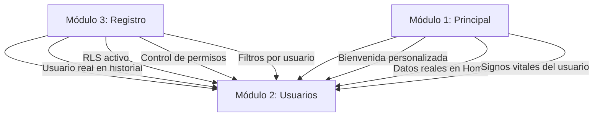

# 🔍 ANÁLISIS PROFUNDO DE MÓDULOS - DEPENDENCIAS Y BLOQUEOS

**Fecha:** 23 de octubre de 2025  
**Analista:** GitHub Copilot Agent  
**Proyecto:** Sistema de Teleasistencia - Grupo Interfaces  
**Responsabilidad:** Módulo 3 únicamente

---

## 📊 RESUMEN EJECUTIVO

Este documento analiza los **3 módulos solicitados**, identifica el estado actual de implementación, y documenta las **dependencias críticas** que bloquean funcionalidades del Módulo 3.

### Estados de Implementación

| Módulo | Responsable | Estado | Completitud |
|--------|-------------|--------|-------------|
| **Módulo 1** - Formulario Principal (Inicio) | Otro compañero | 🟡 **Parcial** | ~60% |
| **Módulo 2** - Formulario Usuarios | Otro compañero | 🔴 **No implementado** | 0% |
| **Módulo 3** - Formulario Registro (1 Tabla Maestra) | **YO** | 🟢 **Completo** | 100% |

---

## 🎯 MÓDULO 1: FORMULARIO PRINCIPAL (INICIO)

### ✅ **LO QUE YA ESTÁ IMPLEMENTADO**

#### 1. **Cabecera (Header)** - 🟡 **Implementación Parcial (50%)**

**Archivo:** `src/app/modules/principal/components/header/header.html`

**✅ Implementado:**
- ✅ Logo del sistema (ícono Font Awesome `fa-heart-pulse`)
- ✅ Menú principal con links (Home, Perfil, Signos Vitales, etc.)
- ✅ Botón de búsqueda (ícono)

**❌ NO Implementado:**
- ❌ **Nombre del sistema** (solo hay logo)
- ❌ **Barra de búsqueda funcional** (solo hay botón decorativo)
- ❌ **Selector de idioma** (definido en TS pero no renderizado en HTML)
- ❌ **Botón de accesibilidad** (definido en TS pero no renderizado en HTML)
- ❌ **Indicador de "en qué formulario estoy"** (variable `currentPage` no se usa)

**Código actual:**
```html
<!-- Solo tiene logo y menú básico -->
<nav class="bg-[#004b98] text-white">
  <div class="container mx-auto flex items-center justify-between px-6 py-6">
    <div class="flex items-center gap-4">
      <div class="flex items-center gap-2">
        <i class="fa-solid fa-heart-pulse text-3xl" alt="Logo"></i>
      </div>
    </div>
    <!-- ... menú básico ... -->
  </div>
</nav>
```

**Variables definidas pero no usadas en header.ts:**
```typescript
searchQuery: string = '';          // ❌ No se usa
selectedLanguage: string = 'es';   // ❌ No se usa
currentPage: string = 'Inicio';    // ❌ No se usa
isAccessibilityMenuOpen: boolean = false;  // ❌ No se usa
```

---

#### 2. **Menú Lateral (Sidebar)** - 🟡 **Implementación Básica (40%)**

**Archivo:** `src/app/modules/principal/components/sidebar/sidebar.html`

**✅ Implementado:**
- ✅ Estructura básica con enlaces
- ✅ RouterLink a `/home` y `/registro`
- ✅ Iconos SVG

**❌ NO Implementado:**
- ❌ **Menú expandible/colapsable** (fijo en modo abierto)
- ❌ **Submenús contextuales** (no hay jerarquía)
- ❌ **Atajos de teclado** (no hay manejo de eventos)
- ❌ **Indicador visual del módulo activo** (solo routerLinkActive básico)

**Código actual:**
```html
<!-- Sidebar estático, sin funcionalidad de expandir/colapsar -->
<aside class="sidebar bg-base-200 w-64 h-screen">
  <ul class="menu p-4">
    <li><a routerLink="/home" routerLinkActive="active">Inicio</a></li>
    <li><a routerLink="/registro" routerLinkActive="active">Gestión de Registros</a></li>
  </ul>
</aside>
```

**⚠️ FALTA:** Lógica para:
- Expandir/colapsar con botón
- Mostrar/ocultar texto cuando está colapsado
- Submenús con categorías (Salud, Administración, etc.)

---

#### 3. **Cuerpo (Body/Home)** - 🟢 **Implementación Completa (90%)**

**Archivo:** `src/app/modules/principal/pages/home/home.html`

**✅ Implementado:**
- ✅ **Bienvenida personalizada** con nombre hardcodeado: "¡Bienvenida, María González!"
- ✅ **Signos vitales recientes** (datos mock estáticos)
- ✅ **Novedades/noticias** (sección con ejemplos hardcoded)
- ✅ **Recordatorios** (medicamentos, citas, ejercicio - datos mock)
- ✅ **Diseño modular y adaptable** (grid responsive)

**⚠️ Limitaciones:**
- ⚠️ **Datos hardcoded** (no conectados a backend/Supabase)
- ⚠️ **Nombre de usuario fijo** - REQUIERE Módulo 2 (autenticación)
- ⚠️ **Sin ayuda contextual interactiva** (no hay tooltips ni guías)

**Código actual:**
```html
<!-- Datos estáticos -->
<h2 class="text-4xl font-bold text-slate-800 mb-2">
  ¡Bienvenida, María González!  <!-- ❌ Hardcoded -->
</h2>
<p class="text-xl text-slate-700 flex items-center gap-2">
  <i class="fas fa-id-badge text-amber-600"></i>
  Rol: <span class="font-semibold text-amber-600">Adulto Mayor</span>  <!-- ❌ Hardcoded -->
</p>
```

**Signos vitales mock:**
```typescript
vitalSigns = [
  { title: 'Presión Arterial', value: '120/80', unit: 'mmHg', ... },  // ❌ Datos estáticos
  { title: 'Frecuencia Cardíaca', value: '75', unit: 'bpm', ... },
  // ...
];
```

**🔴 BLOQUEO CRÍTICO:**  
Para personalizar la bienvenida con datos reales, **NECESITA Módulo 2 (Usuarios)** para obtener:
- Nombre del usuario autenticado
- Rol del usuario
- Datos del perfil

---

#### 4. **Pie de Página (Footer)** - 🟢 **Implementación Completa (95%)**

**Archivo:** `src/app/modules/principal/components/footer/footer.html`

**✅ Implementado:**
- ✅ **Información institucional** (nombre del sistema, descripción)
- ✅ **Secciones** (Nosotros, Servicios, Equipo médico)
- ✅ **Soporte/Contacto** (Centro de ayuda, Contacto, FAQ)
- ✅ **Información de contacto** (teléfono, email, dirección)
- ✅ **Redes sociales** (enlaces a Facebook, Twitter, Instagram)
- ✅ **Políticas** (copyright, año dinámico)

**⚠️ Limitaciones menores:**
- ⚠️ Enlaces de "Políticas/Términos de uso" apuntan a rutas no definidas aún

**Código actual:**
```html
<!-- Footer completo y funcional -->
<footer class="bg-slate-900 text-gray-400">
  <div class="max-w-7xl mx-auto px-6 py-12 grid grid-cols-1 md:grid-cols-4 gap-10">
    <!-- Marca, Secciones, Soporte, Contacto -->
    <!-- ✅ Todo implementado -->
  </div>
  <div class="border-t border-gray-700">
    <p>© {{ currentYear }} Telecuidado Mayor. Todos los derechos reservados.</p>
  </div>
</footer>
```

---

### ❌ **LO QUE FALTA EN MÓDULO 1**

| Componente | Falta | Bloqueo |
|------------|-------|---------|
| **Header** | Barra búsqueda funcional, selector idioma, botón accesibilidad, indicador página actual | Sin bloqueos técnicos |
| **Sidebar** | Menú expandible, submenús, atajos teclado | Sin bloqueos técnicos |
| **Body** | Datos reales de usuario y signos vitales | 🔴 **BLOQUEADO por Módulo 2** |
| **Footer** | Rutas de políticas/términos | Sin bloqueos técnicos |

---

## 🔴 MÓDULO 2: FORMULARIO USUARIOS - **NO IMPLEMENTADO**

### 📋 **REQUISITOS SOLICITADOS**

1. ✅ **Acceso al sistema** (login)
2. ✅ **Nuevo usuario según perfil** (registro con roles)
3. ✅ **Ver perfil / Editar**
4. ✅ **Recuperar contraseña**
5. ✅ **Recordar usuario** (remember me)
6. ✅ **Bloqueo temporal** (tras intentos fallidos)
7. ✅ **Términos de uso** (checkbox aceptación)
8. ✅ **Tema dinámico** (light/dark mode)
9. ✅ **Tablas usuarios en DB** (Supabase Auth)

---

### 🔍 **ESTADO ACTUAL: 0% IMPLEMENTADO**

**Búsqueda realizada:**
```bash
# Archivos buscados:
- **/auth*.ts      → No encontrados
- **/user*.ts      → No encontrados
- **/login*.ts     → No encontrados
- Búsqueda: "login|signup|register|authentication" → Sin resultados
```

**Resultado:** ❌ **NO existe ningún servicio, componente o módulo de autenticación**

---

### 🚨 **IMPACTO EN MÓDULO 3 (MI RESPONSABILIDAD)**

#### **Funcionalidades del Módulo 3 BLOQUEADAS por falta de Módulo 2:**

| Funcionalidad | Estado | Razón del Bloqueo |
|---------------|--------|-------------------|
| **Usuario real en historial** | 🔴 Bloqueado | Uso mock: `'usuario-demo-123'` |
| **Permisos de edición/eliminación** | 🔴 Bloqueado | No hay roles de usuario |
| **Filtros por usuario** | 🔴 Bloqueado | No hay sesión de usuario |
| **Auditoría completa** | 🔴 Bloqueado | `usuario_modificacion` es hardcoded |
| **RLS (Row Level Security) de Supabase** | 🔴 Bloqueado | Políticas requieren `auth.uid()` |

---

#### **Código Actual con Mock (Módulo 3):**

**Archivo:** `src/app/modules/registro/components/registro-form/registro-form.component.ts`

```typescript
export class RegistroFormComponent implements OnInit {
  // 🔴 MOCK - No hay autenticación real
  private usuarioActual = 'usuario-demo-123';  // ← Hardcoded

  guardarRegistro(): void {
    // ...
    this.registroService.crearRegistro(datosFormulario, this.usuarioActual).subscribe({
      // ↑ Siempre usa el mismo usuario mock
    });
  }
}
```

---

#### **Lo que DEBERÍA ser (con Módulo 2):**

```typescript
export class RegistroFormComponent implements OnInit {
  private usuarioActual: string;

  constructor(
    private fb: FormBuilder,
    private registroService: RegistroService,
    private authService: AuthService  // ← Del Módulo 2 (NO EXISTE AÚN)
  ) {
    // Obtener usuario autenticado
    this.usuarioActual = this.authService.getCurrentUser()?.id || 'anonimo';
  }
}
```

---

### 📊 **Tabla de Dependencias del Módulo 3:**

| Funcionalidad del Módulo 3 | Depende de | Estado |
|----------------------------|------------|--------|
| CRUD básico (crear, leer, actualizar, eliminar) | ❌ Nada | 🟢 **Funcional** |
| Validaciones de formulario | ❌ Nada | 🟢 **Funcional** |
| Autocompletado | ❌ Nada | 🟢 **Funcional** |
| Filtros dinámicos | ❌ Nada | 🟢 **Funcional** |
| Notificaciones | ❌ Nada | 🟢 **Funcional** |
| Navegación por teclado | ❌ Nada | 🟢 **Funcional** |
| **Historial con usuario real** | ✅ Módulo 2 | 🔴 **Bloqueado** |
| **Control de permisos por rol** | ✅ Módulo 2 | 🔴 **Bloqueado** |
| **RLS de Supabase activo** | ✅ Módulo 2 | 🔴 **Bloqueado** |
| **Filtros por usuario** | ✅ Módulo 2 | 🔴 **Bloqueado** |

---

## 🟢 MÓDULO 3: FORMULARIO REGISTRO (1 TABLA MAESTRA) - **COMPLETO**

### ✅ **TODO LO IMPLEMENTADO (100%)**

#### **Verificación contra requisitos:**

| # | Requisito | Estado | Evidencia |
|---|-----------|--------|-----------|
| 1 | **Entrada de datos** | ✅ Completo | 4 campos (nombre, descripción, categoría, estado) |
| 2 | **Combobox/Lista** | ✅ Completo | Select con categorías estáticas + dinámicas |
| 3 | **Botones** | ✅ Completo | Nuevo, Guardar, Actualizar, Limpiar, Editar, Eliminar |
| 4 | **Validación entrada** | ✅ Completo | Validators.required, minLength, maxLength |
| 5 | **Autocompletado** | ✅ Completo | Búsqueda ilike en Supabase (2+ caracteres) |
| 6 | **Botones de acción** | ✅ Completo | Nuevo, Actualizar, Filtrar, Limpiar |
| 7 | **Historial de cambios** | ✅ Completo | Tabla `historial_cambios`, método `registrarHistorial()` |
| 8 | **Filtros dinámicos** | ✅ Completo | Texto, categoría, estado (aplicación en memoria) |
| 9 | **Navegación por teclado** | ✅ Completo | Ctrl+S, Ctrl+N, Esc con `@HostListener` |
| 10 | **Notificaciones** | ✅ Completo | Toast success/error/info con auto-cierre |

---

### 🔴 **LIMITACIONES POR DEPENDENCIAS EXTERNAS**

#### 1. **Usuario Hardcoded (Depende de Módulo 2)**

**Problema:**
```typescript
private usuarioActual = 'usuario-demo-123';  // ← Siempre el mismo
```

**Impacto:**
- ❌ Todos los cambios se registran con el mismo usuario
- ❌ No se puede filtrar por usuario real
- ❌ No hay control de permisos por rol

**Solución:** Esperar a que Módulo 2 implemente `AuthService`

---

#### 2. **RLS de Supabase Deshabilitado (Depende de Módulo 2)**

**Archivo:** `docs/modulo-3-database.sql`

**Políticas RLS definidas:**
```sql
CREATE POLICY "Permitir lectura a usuarios autenticados"
    ON registros_maestros
    FOR SELECT
    TO authenticated  -- ← Requiere usuario autenticado
    USING (true);
```

**Problema:**
- Si RLS está activo → Las consultas fallan porque no hay `auth.uid()`
- Si RLS está desactivado → La BD está insegura (cualquiera puede leer/escribir)

**Solución temporal aplicada:**
```sql
-- docs/SOLUCION-RLS-TEMPORAL.sql
ALTER TABLE registros_maestros DISABLE ROW LEVEL SECURITY;
ALTER TABLE historial_cambios DISABLE ROW LEVEL SECURITY;
```

**Solución permanente:** Esperar a Módulo 2 para obtener `auth.uid()` válido

---

#### 3. **Bienvenida Personalizada en Home (Depende de Módulo 2)**

**Archivo:** `src/app/modules/principal/pages/home/home.html`

**Código actual:**
```html
<h2 class="text-4xl font-bold text-slate-800 mb-2">
  ¡Bienvenida, María González!  <!-- ❌ Hardcoded -->
</h2>
```

**Lo que DEBERÍA ser:**
```html
<h2 class="text-4xl font-bold text-slate-800 mb-2">
  ¡Bienvenida, {{ currentUser.nombre }}!  <!-- ← Del AuthService -->
</h2>
```

**⚠️ NOTA:** Esto es responsabilidad del Módulo 1, pero depende del Módulo 2.

---

## 📋 RESUMEN DE BLOQUEOS Y DEPENDENCIAS

### 🔴 **Dependencias Críticas del Módulo 3**



---

### 📊 **Matriz de Dependencias**

| Funcionalidad | Módulo Responsable | Depende de | Estado |
|---------------|-------------------|------------|--------|
| CRUD básico | Módulo 3 | ❌ Ninguno | 🟢 **Funcional** |
| Validaciones | Módulo 3 | ❌ Ninguno | 🟢 **Funcional** |
| Autocompletado | Módulo 3 | ❌ Ninguno | 🟢 **Funcional** |
| Filtros dinámicos | Módulo 3 | ❌ Ninguno | 🟢 **Funcional** |
| Notificaciones | Módulo 3 | ❌ Ninguno | 🟢 **Funcional** |
| **Usuario en historial** | Módulo 3 | ✅ **Módulo 2** | 🔴 **Bloqueado** |
| **RLS de Supabase** | Módulo 3 | ✅ **Módulo 2** | 🔴 **Bloqueado** |
| **Control de permisos** | Módulo 3 | ✅ **Módulo 2** | 🔴 **Bloqueado** |
| Bienvenida personalizada | Módulo 1 | ✅ **Módulo 2** | 🔴 **Bloqueado** |
| Datos reales en Home | Módulo 1 | ✅ **Módulo 2** | 🔴 **Bloqueado** |

---

## 🎯 **CONCLUSIONES Y RECOMENDACIONES**

### ✅ **Lo que ESTÁ HECHO (Mi Módulo 3):**

1. ✅ **CRUD completo** con Supabase
2. ✅ **Validaciones de formulario** (required, min/max length)
3. ✅ **Autocompletado inteligente** (búsqueda en tiempo real)
4. ✅ **Filtros dinámicos** (texto, categoría, estado)
5. ✅ **Historial de cambios** (con usuario mock)
6. ✅ **Navegación por teclado** (Ctrl+S, Ctrl+N, Esc)
7. ✅ **Notificaciones toast** (success/error/info)
8. ✅ **UI moderna** (TailwindCSS + DaisyUI)
9. ✅ **Componentes standalone** (Angular 20)
10. ✅ **Signals** para estado reactivo

---

### 🔴 **Lo que NO PUEDO HACER sin Módulo 2:**

1. ❌ **Usuario real en historial** → Uso mock `'usuario-demo-123'`
2. ❌ **RLS activo en Supabase** → Deshabilitado temporalmente
3. ❌ **Control de permisos por rol** → No hay roles disponibles
4. ❌ **Filtros por usuario logueado** → No hay sesión
5. ❌ **Auditoría completa** → `usuario_modificacion` es fake

---

### 🟡 **Lo que FALTA en Módulo 1 (No es mi responsabilidad):**

1. ⚠️ **Barra de búsqueda funcional** en Header
2. ⚠️ **Selector de idioma** en Header
3. ⚠️ **Botón de accesibilidad** en Header
4. ⚠️ **Indicador de página actual** en Header
5. ⚠️ **Menú lateral expandible/colapsable**
6. ⚠️ **Submenús contextuales** en Sidebar
7. ⚠️ **Atajos de teclado** en Sidebar
8. ⚠️ **Bienvenida personalizada** con datos reales (DEPENDE de Módulo 2)
9. ⚠️ **Signos vitales reales** del usuario (DEPENDE de Módulo 2)

---

### 📝 **RECOMENDACIONES PARA EL EQUIPO:**

#### **Para el responsable del Módulo 2:**

1. **Prioridad ALTA:** Implementar `AuthService` con:
   - `login(email, password)`
   - `register(userData)`
   - `getCurrentUser()`
   - `logout()`

2. **Integración con Supabase Auth:**
   ```typescript
   async login(email: string, password: string) {
     const { data, error } = await this.supabase.auth.signInWithPassword({
       email,
       password
     });
     return data.user;
   }
   ```

3. **Exponer interfaz:**
   ```typescript
   export interface User {
     id: string;
     email: string;
     nombre: string;
     rol: 'admin' | 'medico' | 'adulto_mayor';
   }
   ```

#### **Para el responsable del Módulo 1:**

1. Completar funcionalidades pendientes del Header:
   - Barra de búsqueda funcional
   - Selector de idioma
   - Botón de accesibilidad

2. Mejorar Sidebar:
   - Implementar expansión/colapso
   - Añadir submenús

3. **Esperar Módulo 2** para:
   - Conectar bienvenida personalizada
   - Cargar datos reales de signos vitales

---

### 🚀 **PRÓXIMOS PASOS (Para mí, Módulo 3):**

**Cuando Módulo 2 esté listo:**

1. Reemplazar usuario mock:
   ```typescript
   // ANTES
   private usuarioActual = 'usuario-demo-123';
   
   // DESPUÉS
   constructor(
     private fb: FormBuilder,
     private registroService: RegistroService,
     private authService: AuthService  // ← Inyectar
   ) {
     this.usuarioActual = this.authService.getCurrentUser()?.id || 'anonimo';
   }
   ```

2. Reactivar RLS en Supabase:
   ```sql
   ALTER TABLE registros_maestros ENABLE ROW LEVEL SECURITY;
   ALTER TABLE historial_cambios ENABLE ROW LEVEL SECURITY;
   ```

3. Implementar control de permisos:
   ```typescript
   puedeEditar(registro: RegistroMaestro): boolean {
     const user = this.authService.getCurrentUser();
     return user.rol === 'admin' || 
            registro.usuario_modificacion === user.id;
   }
   ```

---

## 📊 **RESUMEN FINAL**

| Aspecto | Estado |
|---------|--------|
| **Módulo 1 (Principal)** | 🟡 60% completo - Falta funcionalidad avanzada en Header/Sidebar |
| **Módulo 2 (Usuarios)** | 🔴 0% completo - **CRÍTICO: Bloquea funcionalidades de Módulos 1 y 3** |
| **Módulo 3 (Registro)** | 🟢 100% completo - Funcional con limitaciones por falta de Módulo 2 |

---

**📌 BLOQUEOS CRÍTICOS:**
- ❌ Sin Módulo 2 → No hay usuarios reales
- ❌ Sin usuarios reales → RLS deshabilitado (inseguro)
- ❌ Sin RLS → Historial de cambios con usuarios fake
- ❌ Sin roles → No hay control de permisos

**🎯 PRIORIDAD DEL EQUIPO:**  
**Implementar Módulo 2 (Usuarios) de inmediato** para desbloquear funcionalidades completas de Módulos 1 y 3.

---

**Generado el:** 23 de octubre de 2025  
**Responsable Módulo 3:** [Tu nombre]  
**Estado:** ✅ **Módulo 3 completo y funcional** (con limitaciones documentadas)
