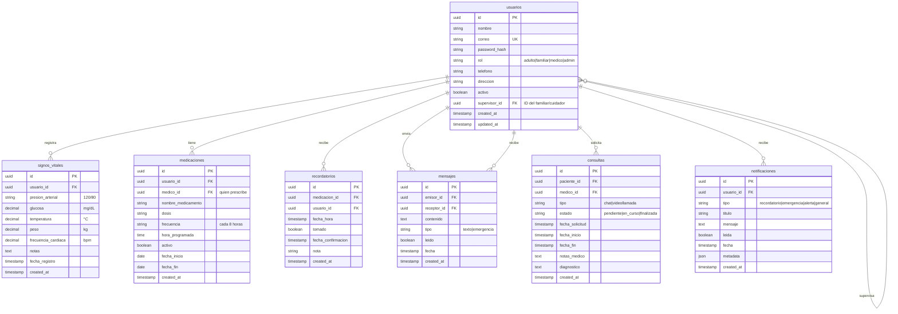
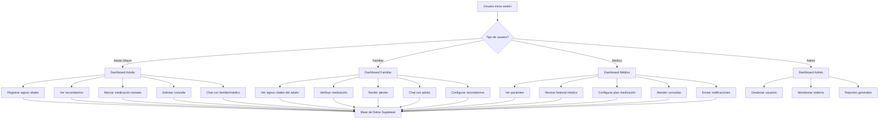
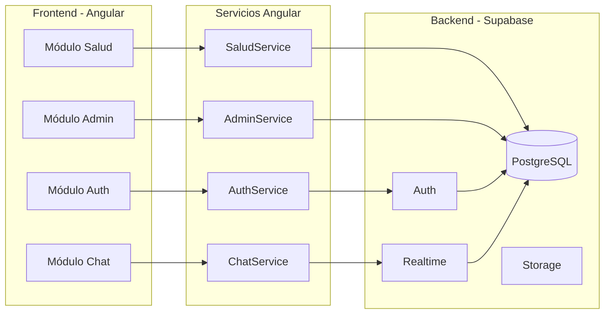

# Diagrama de Base de Datos - Sistema de Teleasistencia

## Diagrama ER (Entity Relationship)

```mermaid
erDiagram
    usuarios ||--o{ signos_vitales : registra
    usuarios ||--o{ medicaciones : tiene
    usuarios ||--o{ recordatorios : recibe
    usuarios ||--o{ mensajes : envia
    usuarios ||--o{ mensajes : recibe
    usuarios ||--o{ consultas : solicita
    usuarios ||--o{ notificaciones : recibe
    usuarios }o--o{ usuarios : supervisa

    usuarios {
        uuid id PK
        string nombre
        string correo UK
        string password_hash
        string rol "adulto|familiar|medico|admin"
        string telefono
        string direccion
        boolean activo
        uuid supervisor_id FK "ID del familiar/cuidador"
        timestamp created_at
        timestamp updated_at
    }

    signos_vitales {
        uuid id PK
        uuid usuario_id FK
        string presion_arterial "120/80"
        decimal glucosa "mg/dL"
        decimal temperatura "°C"
        decimal peso "kg"
        decimal frecuencia_cardiaca "bpm"
        text notas
        timestamp fecha_registro
        timestamp created_at
    }

    medicaciones {
        uuid id PK
        uuid usuario_id FK
        uuid medico_id FK "quien prescribe"
        string nombre_medicamento
        string dosis
        string frecuencia "cada 8 horas"
        time hora_programada
        boolean activo
        date fecha_inicio
        date fecha_fin
        timestamp created_at
    }

    recordatorios {
        uuid id PK
        uuid medicacion_id FK
        uuid usuario_id FK
        timestamp fecha_hora
        boolean tomado
        timestamp fecha_confirmacion
        string nota
        timestamp created_at
    }

    mensajes {
        uuid id PK
        uuid emisor_id FK
        uuid receptor_id FK
        text contenido
        string tipo "texto|emergencia"
        boolean leido
        timestamp fecha
        timestamp created_at
    }

    consultas {
        uuid id PK
        uuid paciente_id FK
        uuid medico_id FK
        string tipo "chat|videollamada"
        string estado "pendiente|en_curso|finalizada"
        timestamp fecha_solicitud
        timestamp fecha_inicio
        timestamp fecha_fin
        text notas_medico
        text diagnostico
        timestamp created_at
    }

    notificaciones {
        uuid id PK
        uuid usuario_id FK
        string tipo "recordatorio|emergencia|alerta|general"
        string titulo
        text mensaje
        boolean leida
        timestamp fecha
        json metadata
        timestamp created_at
    }
```

## Diagrama de Flujo de Datos

```mermaid
flowchart TD
    A[Usuario inicia sesión] --> B{Tipo de usuario?}
    
    B -->|Adulto Mayor| C[Dashboard Adulto]
    B -->|Familiar| D[Dashboard Familiar]
    B -->|Médico| E[Dashboard Médico]
    B -->|Admin| F[Dashboard Admin]
    
    C --> C1[Registrar signos vitales]
    C --> C2[Ver recordatorios]
    C --> C3[Marcar medicación tomada]
    C --> C4[Solicitar consulta]
    C --> C5[Chat con familiar/médico]
    
    D --> D1[Ver signos vitales del adulto]
    D --> D2[Verificar medicación]
    D --> D3[Recibir alertas]
    D --> D4[Chat con adulto]
    D --> D5[Configurar recordatorios]
    
    E --> E1[Ver pacientes]
    E --> E2[Revisar historial médico]
    E --> E3[Configurar plan medicación]
    E --> E4[Atender consultas]
    E --> E5[Enviar notificaciones]
    
    F --> F1[Gestionar usuarios]
    F --> F2[Monitorear sistema]
    F --> F3[Reportes generales]
    
    C1 --> G[Base de Datos Supabase]
    C2 --> G
    C3 --> G
    C4 --> G
    C5 --> G
    D1 --> G
    D2 --> G
    D3 --> G
    D4 --> G
    D5 --> G
    E1 --> G
    E2 --> G
    E3 --> G
    E4 --> G
    E5 --> G
```

## Diagrama de Arquitectura del Sistema

```mermaid
flowchart LR
    subgraph Frontend["Frontend - Angular"]
        A1[Módulo Auth]
        A2[Módulo Salud]
        A3[Módulo Chat]
        A4[Módulo Admin]
    end
    
    subgraph Backend["Backend - Supabase"]
        B1[(PostgreSQL)]
        B2[Auth]
        B3[Realtime]
        B4[Storage]
    end
    
    subgraph Servicios["Servicios Angular"]
        C1[AuthService]
        C2[SaludService]
        C3[ChatService]
        C4[AdminService]
    end
    
    A1 --> C1
    A2 --> C2
    A3 --> C3
    A4 --> C4
    
    C1 --> B2
    C2 --> B1
    C3 --> B3
    C4 --> B1
    
    B2 --> B1
    B3 --> B1
```
